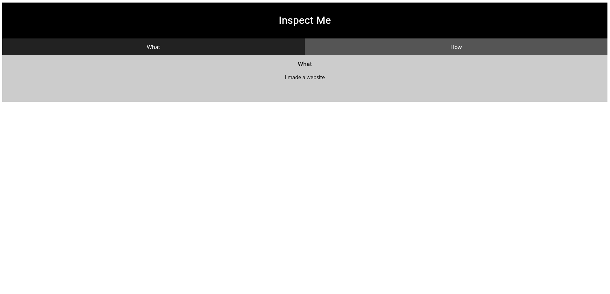
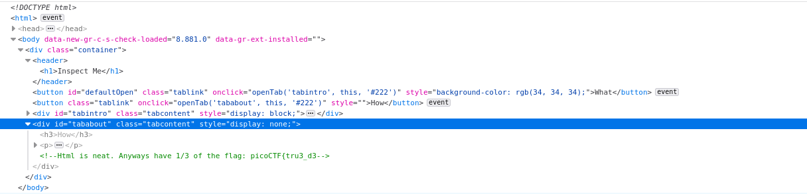
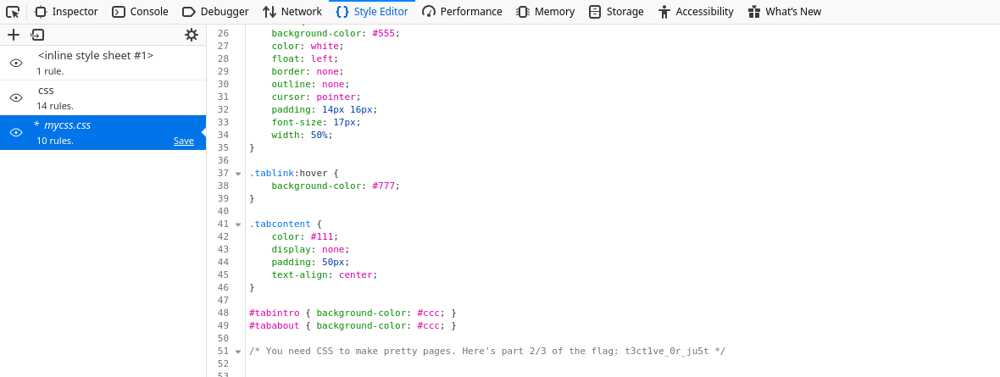
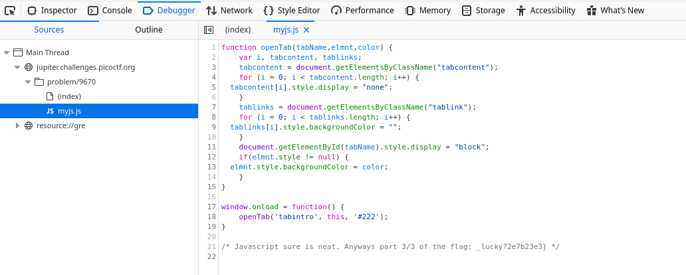

### Problem Statement:
```txt
Kishor Balan tipped us off that the following code may need inspection:
https://jupiter.challenges.picoctf.org/problem/9670
```

---

When we open the link, we're greeted with:



<br>
<br>

When we inspect the page we find...



So we have the first part of our flag: `picoCTF{tru3_d3`

<br>
<br>

Next, when we look through the css files we find the second part of the flag: `t3ct1ve_0r_ju5t`



<br>
<br>

And lastly, when we have a look at the javascript files, we can find the third/last part of the flag: `_lucky?2e7b23e3}`



<br>

---
#### The Flag:
    picoCTF{tru3_d3t3ct1ve_0r_ju5t_lucky?2e7b23e3}


Link to the challenge: [Insp3ct0r](https://play.picoctf.org/practice/challenge/18)
