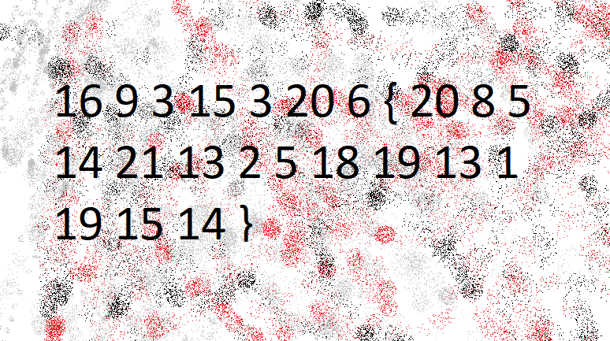

### Problem Statement:
```txt
The "numbers"... what do they mean?
```

_[numbers](https://jupiter.challenges.picoctf.org/static/f209a32253affb6f547a585649ba4fda/the_numbers.png)_


---


The link gives us an image:



<br>
<br>

Well, one close look tells us that the numbers represent the position of english letters in the alphabet.

To decipher this we can use a script similar too `decode_nums.py`:

```zsh
$ python3 decode_nums.py
The flag: PICOCTF{THENUMBERSMASON}
```

---

#### Flag:
    PICOCTF{THENUMBERSMASON}

Link to the challenge: [The Numbers](https://play.picoctf.org/practice/challenge/68)
